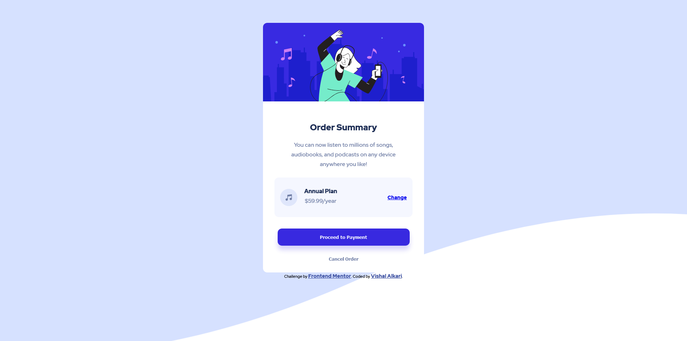

# Frontend Mentor - Order summary card solution

This is a solution to the [Order summary card challenge on Frontend Mentor](https://www.frontendmentor.io/challenges/order-summary-component-QlPmajDUj). Frontend Mentor challenges help you improve your coding skills by building realistic projects.

## Table of contents

- [Overview](#overview)
  - [The challenge](#the-challenge)
  - [Screenshot](#screenshot)
  - [Links](#links)
- [My process](#my-process)
  - [Built with](#built-with)
  - [What I learned](#what-i-learned)
  - [Continued development](#continued-development)
  - [Useful resources](#useful-resources)
- [Author](#author)
- [Acknowledgments](#acknowledgments)

## Overview

### The challenge

Users should be able to:

- See hover states for interactive elements

### Screenshot

### Links

- Solution URL: [Add solution URL here](https://github.com/vish5268/Order-Summary)
- Live Site URL: [Add live site URL here](https://vish5268.github.io/Order-Summary/)

## My process

This is the first challenge I did after completing HTML & CSS basics so there's a room for lot of improvements % surely I'll be redoing this with lesser code & Sass later to simplify the view.

Now coming to the thought process:

1. Setting up the HTML:

   I break down the components into separate blocks & then try to recheck if all the things are in the propper order. Once I finish laying out the HTML, I start the styling using basic CSS.

2. Setting up the Styles:
   I start with 2 most important things: declaring box-sizing & setting margin to 0.

   After that, I check the design to set the font-family,size & other repetitive properties to avoid redeclaration of same properties throughout the styles for each individual bit.

   I start with semantic tags, then with the classes & required hover/focus states & finally with the media queries.

### Built with

- HTML5 markup
- CSS custom properties
- Flexbox
- Mobile-first workflow

### What I learned

Doing things on your own & watching someone do it during a bootcamp or explaining concepts in some videos is all together world apart. I've made some great designs after going through the steps the mentor provide but doing things from scratch really makes you think about various aspects that one should redo to avoid further complications.

Fundamentals maybe easy to learn but hard to follow once you start building things independently.
Practice is the key!

### Continued development

Areas I'd like to practice on:

1. CSS flexbox & GRID templates
2. Breakdown of components in a better way

### Useful resources

- [1](https://youtu.be/-JNRQ5HjNeI) - This helped me with box-shadows which I rarely used before. I really liked this pattern and will use it going forward.

## Author

- Frontend Mentor - [@vish5268](https://www.frontendmentor.io/profile/vish5268)

## Acknowledgments

I'd like to thank Kevin Powell for his easy to follow videos on various topics on CSS.
